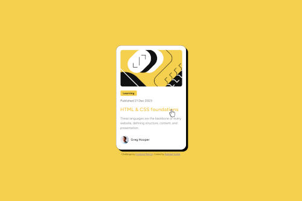

# Frontend Mentor - Blog preview card solution

This is a solution to the [Blog preview card challenge on Frontend Mentor](https://www.frontendmentor.io/challenges/blog-preview-card-ckPaj01IcS). Frontend Mentor challenges help you improve your coding skills by building realistic projects. 

## Table of contents

- [Overview](#overview)
  - [The challenge](#the-challenge)
  - [Screenshot](#screenshot)
  - [Links](#links)
- [My process](#my-process)
  - [Built with](#built-with)
  - [What I learned](#what-i-learned)
  - [Continued development](#continued-development)
- [Author](#author)

## Overview

### The challenge

Users should be able to:

- See hover and focus states for all interactive elements on the page

### Screenshot

### Links

- Live Site URL: [Check it out here!](https://raphaelsobral.github.io/studies/challenge-004/index.html)

## My process

### Built with

- Semantic HTML5 markup
- CSS custom properties
- Flexbox
- Mobile-first workflow

### What I learned
Beside all the flexbox and adjusting the font, margin and padding sizes which is making me undrstand more about pixels, em and all the stuff, I am also having a lot of fun understanding more about the harmony of colors and fonts a page.

### Continued development

I want to keep studying flexbox and mobile-first workflow along with media queries. I also want to star using variables for the fonts and colors.

### Useful resources

## Author

- Linkedin - [Raphael Sobral](https://www.linkedin.com/in/raphael-sobral-38766430b/)
- Frontend Mentor - [@raphaelsobral](https://www.frontendmentor.io/profile/raphaelsobral)

## Acknowledgments

I want to thank my chubby cat Onew who kept me company during all the project.
