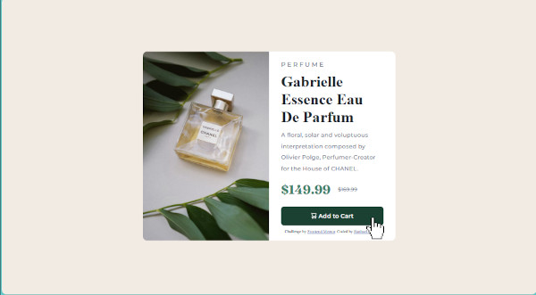

# Frontend Mentor - Product preview card component solution

This is a solution to the [Product preview card component challenge on Frontend Mentor](https://www.frontendmentor.io/challenges/product-preview-card-component-GO7UmttRfa). Frontend Mentor challenges help you improve your coding skills by building realistic projects. 

## Table of contents

- [Overview](#overview)
  - [The challenge](#the-challenge)
  - [Screenshot](#screenshot)
  - [Links](#links)
- [My process](#my-process)
  - [Built with](#built-with)
  - [What I learned](#what-i-learned)
  - [Continued development](#continued-development)
- [Author](#author)
- [Acknowledgments](#acknowledgments)

## Overview

### The challenge

Users should be able to:

- View the optimal layout depending on their device's screen size
- See hover and focus states for interactive elements

### Screenshot

### Links

- Live Site URL: [Click here to check it out!](https://raphaelsobral.github.io/studies/challenge-006/index.html)

## My process

### Built with

- Semantic HTML5 markup
- CSS custom properties
- Flexbox
- Mobile-first workflow

### What I learned

I have started using css variables and started using the aria-hidden property. I think I got the hang of flexbox since I have been able to use it without getting lost like I used to do.

### Continued development

I want to focus more on accessibility and try to develop faster.

## Author

- Frontend Mentor - [@yourusername](https://www.frontendmentor.io/profile/raphaelsobral)
- Linkedin - [raphaelsobral](https://www.linkedin.com/in/raphael-sobral-38766430b/)

## Acknowledgments

My cat did not help me with any ideas or something like this but he gave me support by looking cute and giving me emotional support headbutts. Thanks Onew!
