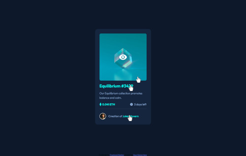

# Frontend Mentor - NFT preview card component solution

This is a solution to the [NFT preview card component challenge on Frontend Mentor](https://www.frontendmentor.io/challenges/nft-preview-card-component-SbdUL_w0U). Frontend Mentor challenges help you improve your coding skills by building realistic projects. 

## Table of contents

- [Overview](#overview)
  - [The challenge](#the-challenge)
  - [Screenshot](#screenshot)
  - [Links](#links)
- [My process](#my-process)
  - [Built with](#built-with)
  - [What I learned](#what-i-learned)
  - [Continued development](#continued-development)
- [Author](#author)
## Overview

### The challenge

Users should be able to:

- View the optimal layout depending on their device's screen size
- See hover states for interactive elements

### Screenshot



### Links

- Live Site URL: [Click here to check it out!](https://raphaelsobral.github.io/studies/challenge-007/index.html)

## My process

### Built with

- Semantic HTML5 markup
- CSS custom properties
- Flexbox
- Mobile-first workflow

### What I learned

I'm learning how to organize my containers better and also learned the ``` aria-hidden="true" ``` attribute. 

### Continued development

I want to expand my knowledge about accessibility, flexbox and media queries. Also, I want to start using JS in my projects.

## Author

- Linkedin - [Raphael Sobral](https://www.linkedin.com/in/raphael-sobral-38766430b/)
- Frontend Mentor - [@raphaelsobral](https://www.frontendmentor.io/profile/raphaelsobral)

