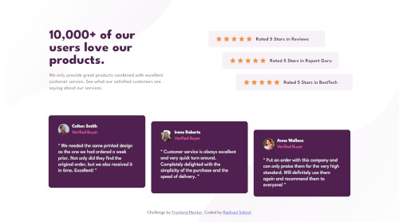

# Frontend Mentor - Social proof section solution

This is a solution to the [Social proof section challenge on Frontend Mentor](https://www.frontendmentor.io/challenges/social-proof-section-6e0qTv_bA). Frontend Mentor challenges help you improve your coding skills by building realistic projects. 

## Table of contents

- [Overview](#overview)
  - [The challenge](#the-challenge)
  - [Screenshot](#screenshot)
  - [Links](#links)
- [My process](#my-process)
  - [Built with](#built-with)
  - [What I learned](#what-i-learned)
  - [Continued development](#continued-development)
- [Author](#author)

## Overview

### The challenge

Users should be able to:

- View the optimal layout for the section depending on their device's screen size

### Screenshot

### Links

- Live Site URL: [Check it out here!](https://raphaelsobral.github.io/studies/challenge-012/index.html)

## My process

### Built with

- Semantic HTML5 markup
- CSS custom properties
- Flexbox
- Mobile-first workflow

### What I learned

Since the mobile version is so different from the desktop one, I had to learn how to personalize it using margins, paddings and so.

### Continued development

I want to keep using flex and start leaning about css grid and javascript.

## Author

- LinkedIn - [Raphael Sobral](https://www.linkedin.com/in/raphael-sobral-38766430b/)
- Frontend Mentor - [@raphaelsobral](https://www.frontendmentor.io/profile/raphaelsobral)

