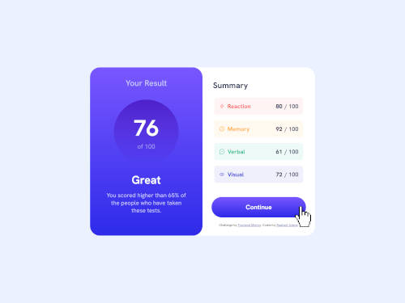

# Frontend Mentor - Results summary component solution

This is a solution to the [Results summary component challenge on Frontend Mentor](https://www.frontendmentor.io/challenges/results-summary-component-CE_K6s0maV). Frontend Mentor challenges help you improve your coding skills by building realistic projects. 

## Table of contents

- [Overview](#overview)
  - [The challenge](#the-challenge)
  - [Screenshot](#screenshot)
  - [Links](#links)
- [My process](#my-process)
  - [Built with](#built-with)
  - [What I learned](#what-i-learned)
  - [Continued development](#continued-development)
  - [Useful resources](#useful-resources)
- [Author](#author)

## Overview

### The challenge

Users should be able to:

- View the optimal layout for the interface depending on their device's screen size
- See hover and focus states for all interactive elements on the page
- **Bonus**: Use the local JSON data to dynamically populate the content

### Screenshot

### Links

- Live Site URL: [Click here to check it!](https://raphaelsobral.github.io/studies/challenge-5/index.html)

## My process

### Built with

- Semantic HTML5 markup
- CSS custom properties
- Flexbox
- Mobile-first workflow

### What I learned

 I learned how to make the website more responsive for each screen, using media queries and flexbox. 

### Continued development

 I want to go deeper into the flexbox and media queries world and also I want to study more about acessibility since it is so important. 

## Author

- Frontend Mentor - [@raphaelsobral](https://www.frontendmentor.io/profile/raphaelsobral)
- Linkedin - [raphaelsobral](https://www.linkedin.com/in/raphael-sobral-38766430b/)
